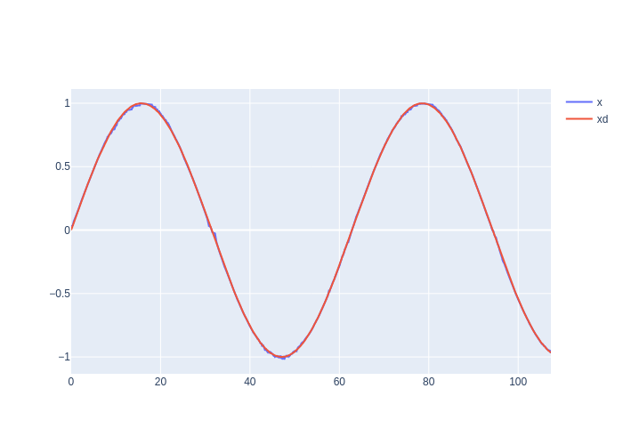

# ONSMC in realtime on the RMD X8 using ROS2

This repo implements my most recent paper, "Online Neural Sldiing Mode Control with Guaranteed Stability", on the RMD X8 servo in our lab using ROS2.

This is specifically for the MyActuator RMD X8 1:6 like we have in the advanced robotics lab at UAH. We have the actuator hooked to a DC power supply at 24V and talk to it through a VSCom USB-CAN Plus adapter.

We have had lots of trouble with this servo. Specifically, the internal PI loop of the current controller had to be tuned. Default parameters were (Kp, Ki) = (50, 50). After many current loop tracking experiments, we settled on gains (36, 5). This gives the controller enough "twitch" to hold the desired trajectory and not hang but not enough to chatter.

We also had rough results for anything other than using realtime control. I cannot say how important it is to run this in realtime.

For running the experiment: (only on linux)

# Commands

    sudo -i
    echo -1 >> /proc/sys/kernel/sched_rt_runtime_us
    slcand -c -o -s8 -t hw -S 3000000 /dev/ttyUSB0
    ip link set up slcan0
    ip link set slcan0 txqueuelen 1

or, all in one:
    echo -1 >> /proc/sys/kernel/sched_rt_runtime_us && slcand -c -o -s8 -t hw -S 3000000 /dev/ttyUSB0 && ip link set up slcan0 && ip link set slcan0 txqueuelen 1

## new window: run

    echo $LD_LIBRARY_PATH
    LD_LIBRARY_PATH=$LD_LIBRARY_PATH:/home/jake/ros2_ws/build/onsmc_rt
    export LD_LIBRARY_PATH
    source install/setup.bash
    ros2 launch onsmc_rt experiment.launch.py

## new window: start experiment

    source install/setup.bash
    ros2 topic pub --once /experiment/go std_msgs/msg/Bool "{data: 1}"

## new window: build (if needed)

    colcon build --cmake-arg -DCMAKE_BUILD_TYPE=Release --packages-select onsmc_rt

# TODO
- try at higher frequencies (200 Hz)?